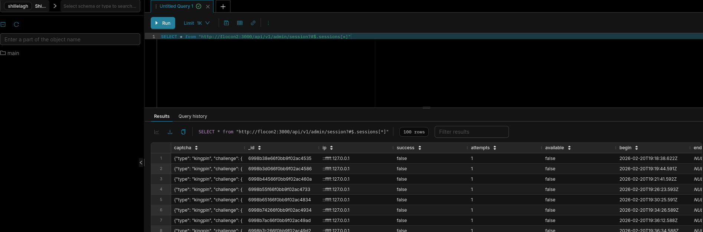

# geocaptcha-shillelagh

## Objectif 

fournir un connecteur dédié à l'API Geocaptcha pour Apache superset (https://superset.apache.org/)

Développement basé sur l'utilisation du driver Shillelagh (https://github.com/betodealmeida/shillelagh)


## RETEX driver Shillelagh avec le connecteur Generic JSON API 

### Référence :
- https://shillelagh.readthedocs.io/en/stable/adapters.html#generic-json-apis
- https://superset.apache.org/developer-docs/contributing/development-setup/#docker-compose-recommended
- https://preset.io/blog/accessing-apis-with-superset/
- https://github.com/qleroy/shillelagh-gristapi/tree/main
- https://stackoverflow.com/questions/79454470/integrate-superset-with-api-using-shillelagh

### Installation (docker compose) 

clonage projet Github apache superset

Ajout du driver Shillelagh dans le code superset : 

./docker/requirements-local.txt
```
shillelagh[genericjsonapi]
```

configuration (nécessaire ?) pour autoriser les extensions qui ont besoin d'accéder au système de fichier et à la base de données de configuration
./docker/pythonpath_dev/superset_config.py
```python
...

# évite de bloquer le driver SHillelagh pour les connecteurs qui ont besoin d'accéder au système de fichier 
# nécessaire sauf si :
# on place shillelagh+safe:// dans l'URI de connexion
# le connecteur déclare qu'il est safe dans la déclaration de la classe :
#    # adapter doesn’t read or write from the filesystem we can mark it as safe.
#    safe = True
PREVENT_UNSAFE_DB_CONNECTIONS = False

...
```


```bash
docker compose up --build
```

après lancement de l'instance superset, ajouter une base de données (Settings -> Database connections)

choisir database Shillelagh

paramètres standards :


paramètres avancés :


exemple pour Engine parameters : 
```json
{
  "connect_args":
  {
    "adapters":["genericjsonapi"],
    "adapter_kwargs":
    {
      "genericjsonapi":
      {
        "request_headers":
        {
          "x-api-key": "******",
          "x-app-id": "*****"
         }
       }
     }
   }
}
```

tester dans SQL Lab :



exemple de requête : 

SELECT * from "http://flocon2:3000/api/v1/admin/session?#$.sessions[*]"

Endpoint API Geocaptcha = http://flocon2:3000
path = /api/v1/admin/session
$.sessions[*] => extraire la collection derrière le champ  session de la réponse


### conclusion

- requête réussie ;-)
- pas de reconnaissance des champs date / time (ISO 8601) fournis
    - voir utilisation du templating Jinja côté apache superset (https://superset.apache.org/user-docs/using-superset/sql-templating)
- pas de gestion de la pagination
- système de cache recommandé
    - pas de REDIS, valkey, mais il y a un driver duckdb ?


## Description

The GeoCaptcha API (developed by IGNF — Institut National de l'Information Géographique
et Forestière) provides geographic CAPTCHA challenges where users prove they are human
by identifying locations on a map.  The admin API exposes two key resources:

| Resource  | Description                                    |
|-----------|------------------------------------------------|
| `session` | Captcha-solving session records with outcomes  |
| `cuser`   | API client users and their access keys         |

This package provides two Shillelagh adapters — one per resource — so you can query
them with standard SQL:

```sql
-- Success rate per challenge
SELECT challenge_name,
       COUNT(*)                                           AS total,
       SUM(CASE WHEN success THEN 1 ELSE 0 END)          AS successes,
       AVG(duration)                                      AS avg_duration_s
FROM   "https://geocaptcha.example.com/api/v1/admin/session"
GROUP  BY challenge_name;

-- List all API users
SELECT app_id, email, role
FROM   "https://geocaptcha.example.com/api/v1/admin/cuser";
```


## Installation

```bash
pip install geocaptcha-shillelagh
```

### Requirements

- Python ≥ 3.9
- `shillelagh >= 1.4`
- `python-dateutil >= 2.8`
- `requests-cache >= 1.0`


## Usage

### Python DB-API

```python
from shillelagh.backends.apsw.db import connect

conn = connect(
    ":memory:",
    adapter_kwargs={
        "geocaptchasessionadapter": {
            "api_key": "YOUR_API_KEY",
            "app_id":  "YOUR_APP_ID",
        },
        "geocaptchacuseradapter": {
            "api_key": "YOUR_API_KEY",
            "app_id":  "YOUR_APP_ID",
        },
    },
)

cursor = conn.cursor()
cursor.execute(
    'SELECT * FROM "https://geocaptcha.example.com/api/v1/admin/session"'
)
for row in cursor:
    print(row)
```

### SQLAlchemy

```python
from sqlalchemy import create_engine, text

engine = create_engine(
    "shillelagh://",
    connect_args={
        "adapter_kwargs": {
            "geocaptchasessionadapter": {
                "api_key": "YOUR_API_KEY",
                "app_id":  "YOUR_APP_ID",
            },
        }
    },
)

with engine.connect() as con:
    result = con.execute(
        text('SELECT * FROM "https://geocaptcha.example.com/api/v1/admin/session"')
    )
    for row in result:
        print(row)
```

### Apache Superset

1. Add a new database connection in Superset with the SQLAlchemy URI:
   ```
   shillelagh://
   ```
2. Under **Advanced → Other → Engine Parameters**, add:
   ```json
   {
     "connect_args": {
       "adapter_kwargs": {
         "geocaptchasessionadapter": {
           "api_key": "YOUR_API_KEY",
           "app_id":  "YOUR_APP_ID"
         },
         "geocaptchacuseradapter": {
           "api_key": "YOUR_API_KEY",
           "app_id":  "YOUR_APP_ID"
         }
       }
     }
   }
   ```
3. Use the full API URL as the table name in SQL Lab:
   ```sql
   SELECT *
   FROM "https://geocaptcha.example.com/api/v1/admin/session"
   LIMIT 100;
   ```


## Virtual table columns

### `session` table

| Column           | Type     | Description                                          |
|------------------|----------|------------------------------------------------------|
| `session_id`     | String   | Unique session identifier                            |
| `success`        | Boolean  | `true` if the user solved the captcha                |
| `begin`          | DateTime | Session start time                                   |
| `end`            | DateTime | Session end time                                     |
| `duration`       | Float    | Duration in seconds (`NULL` if timestamps missing)   |
| `challenge_name` | String   | Name of the geographic challenge presented           |

### `cuser` table

| Column    | Type   | Description                              |
|-----------|--------|------------------------------------------|
| `app_id`  | String | Unique application identifier / key name |
| `email`   | String | Contact e-mail address                   |
| `referer` | String | Allowed HTTP `Referer` domain            |
| `role`    | String | Role (`user`, `admin`, …)                |


## Authentication

Credentials are **never** embedded in the URI.  Pass them as adapter connection
arguments (`api_key` and `app_id`) as shown in the examples above.


## Project structure

```
.
├── src/
│   └── geocaptcha_shillelagh/
│       ├── __init__.py
│       └── adapter.py      # GeoCaptchaSessionAdapter & GeoCaptchaCUserAdapter
├── tests/
│   └── test_adapter.py
├── pyproject.toml
└── README.md
```


## Development

```bash
# Clone & install in editable mode with dev extras
git clone https://github.com/ledav-perso/geocaptcha-shillelagh.git
cd geocaptcha-shillelagh
pip install -e ".[dev]"

# Run tests
pytest
```
