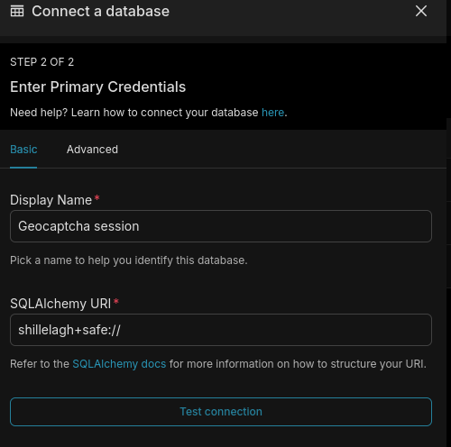
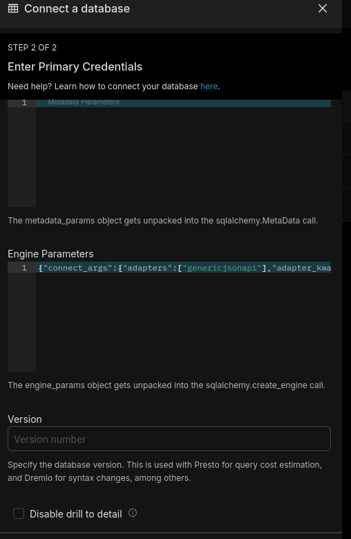

# RETEX driver Shillelagh avec le connecteur Generic JSON API

configuration (nécessaire ?) pour autoriser les extensions qui ont besoin d'accéder au système de fichier et à la base de données de configuration
./docker/pythonpath_dev/superset_config.py
```python
...

# évite de bloquer le driver SHillelagh pour les connecteurs qui ont besoin d'accéder au système de fichier
# nécessaire sauf si :
# on place shillelagh+safe:// dans l'URI de connexion
# le connecteur déclare qu'il est safe dans la déclaration de la classe :
#    # adapter doesn’t read or write from the filesystem we can mark it as safe.
#    safe = True
PREVENT_UNSAFE_DB_CONNECTIONS = False

...
```

et ajout package geocaptcha-shillelagh


après lancement de l'instance superset, ajouter une base de données (Settings -> Database connections)

choisir database Shillelagh

paramètres standards :



paramètres avancés :



placer dans Engine parameters :

```json
{
  "connect_args":
  {
    "adapters":["geocaptcha"],
    "adapter_kwargs":
    {
      "geocaptcha":
      {
        "base_url":"http://flocon2:3000/api/v1/admin",
        "app_id":"admin",
        "api_key":"**********************************",
        "log_level":"ERROR",
        "page_size":1000
      }
    }
  }
}

```

paramètre | valeur par défaut | description
----- | ----- | ----------
base_url | https://geocaptcha.ign.fr/api/v1/admin | Endpoint API Geocaptcha
app_id | NA | compte admin
api_key | NA | mdp admin
log_level | ERROR | log level du composant
page_size | 1000 | nombre de documents extraits
