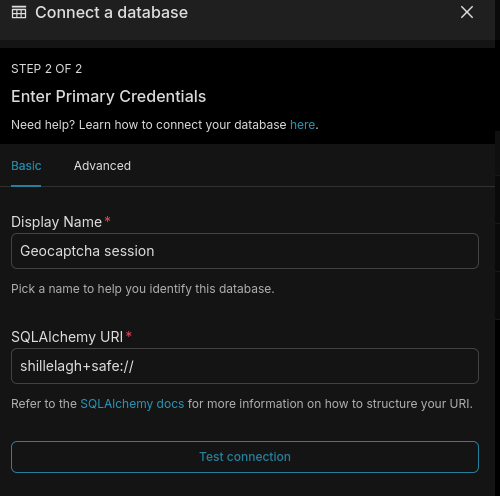
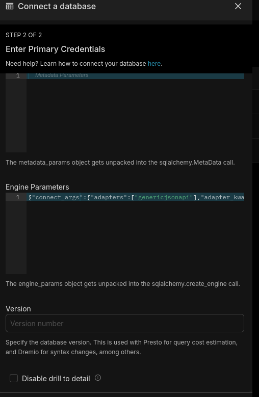

# RETEX driver Shillelagh avec le connecteur Generic JSON API 

## Référence :
- https://shillelagh.readthedocs.io/en/stable/adapters.html#generic-json-apis
- https://superset.apache.org/developer-docs/contributing/development-setup/#docker-compose-recommended
- https://preset.io/blog/accessing-apis-with-superset/
- https://github.com/qleroy/shillelagh-gristapi/tree/main
- https://stackoverflow.com/questions/79454470/integrate-superset-with-api-using-shillelagh

## Installation (docker compose) 

clonage projet Github apache superset

Ajout du driver Shillelagh dans le code superset : 

./docker/requirements-local.txt
```
shillelagh[genericjsonapi]
```

configuration (nécessaire ?) pour autoriser les extensions qui ont besoin d'accéder au système de fichier et à la base de données de configuration
./docker/pythonpath_dev/superset_config.py
```python
...

# évite de bloquer le driver SHillelagh pour les connecteurs qui ont besoin d'accéder au système de fichier 
# nécessaire sauf si :
# on place shillelagh+safe:// dans l'URI de connexion
# le connecteur déclare qu'il est safe dans la déclaration de la classe :
#    # adapter doesn’t read or write from the filesystem we can mark it as safe.
#    safe = True
PREVENT_UNSAFE_DB_CONNECTIONS = False

...
```


```bash
docker compose up --build
```

après lancement de l'instance superset, ajouter une base de données (Settings -> Database connections)

choisir database Shillelagh

paramètres standards :



paramètres avancés :



exemple pour Engine parameters : 
```json
{
  "connect_args":
  {
    "adapters":["genericjsonapi"],
    "adapter_kwargs":
    {
      "genericjsonapi":
      {
        "request_headers":
        {
          "x-api-key": "******",
          "x-app-id": "*****"
         }
       }
     }
   }
}
```

tester dans SQL Lab :


exemple de requête : 

SELECT * from "http://flocon2:3000/api/v1/admin/session?#$.sessions[*]"

- Endpoint API Geocaptcha = http://flocon2:3000
- path = /api/v1/admin/session
- $.sessions[*] => extraire la collection derrière le champ  session de la réponse


## conclusion

- requête réussie ;-)
- pas de reconnaissance des champs date / time (ISO 8601) fournis
    - voir utilisation du templating Jinja côté apache superset (https://superset.apache.org/user-docs/using-superset/sql-templating)
- pas de gestion de la pagination
- système de cache recommandé pour ne pas multiplier les appels à l'API
    - pas de REDIS, valkey, mais il y a un driver duckdb ?
