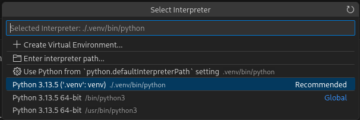

# Installation env. de développement

## Geocaptcha

**installation avec les jeux de données test:**

INITIAL_DATA=true docker compose -f compose-local.yaml up -d

**attendre que tout soit opérationnel :**

docker compose -f compose-local.yaml ps

**arrêter le portail démo car il utilise l'un des ports de service superset :**

docker compose -f compose-local.yaml stop demo

**suivre l'activité de l'API :**

docker compose -f compose-local.yaml logs api -f

## Superset

git clone superset

**installation shillelagh-geocaptcha :**

cd ~/sources/superset/docker/pythonpath_dev/

superset_config.py
```
...

PREVENT_UNSAFE_DB_CONNECTIONS = False
```


git clone https://ledav-perso@github.com/ledav-perso/geocaptcha-shillelagh.git

**lancement de superset :**

cd ~/sources/superset

docker compose up --build

docker compose logs superset -f


## Préparation de l'env. de développement

cd ~/sources/geocaptcha-shillelagh

python3 -m venv .venv

pip install --upgrade pip

pip install -r requirements.txt

pour l'utilisation avec VS Codium



**unopiniated formating :**

python -m black src

**linting :**

python -m pylint src
